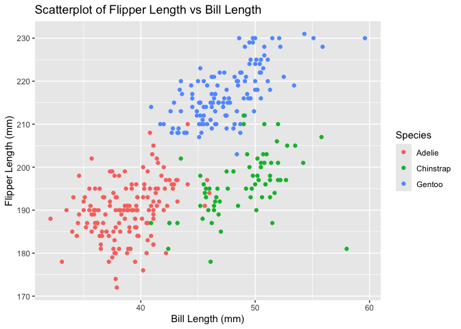

Homework 1 taa2158
================
Tanmayi Amanchi
2024-09-13

\##Problem 1

First I will use the following code to load the penguins dataset

``` r
  data("penguins", package = "palmerpenguins")
```

The species of penguins in this dataset are Adelie from the Torgersen
island. There is information about their bill length (mm), bill depth
(mm), flipper length (mm), body mass (g), sex, and year.

Using the nrow and ncol function

``` r
  nrow(penguins)
```

    ## [1] 344

``` r
  ncol(penguins)
```

    ## [1] 8

There are 344 observations and 8 variables.

Using the Mean function and ommitting rows with NA in the calculation

``` r
  mean(na.omit(penguins[["flipper_length_mm"]]))
```

    ## [1] 200.9152

The mean flipper length is 200.9152

Now I will make a scatter plot of flipper_length_mm (y) vs
bill_length_mm (x); color points using the species variable. I’ve first
loaded the tidyverse package in order to create the scatter plot before
using the ggplot function. I will also save this plot as a jpeg using
the ggsave function. As noted in the warnings the rows containing
missing values or values outside the scale range were not included in
the plot.

``` r
library(tidyverse)
```

    ## ── Attaching core tidyverse packages ──────────────────────── tidyverse 2.0.0 ──
    ## ✔ dplyr     1.1.4     ✔ readr     2.1.5
    ## ✔ forcats   1.0.0     ✔ stringr   1.5.1
    ## ✔ ggplot2   3.5.1     ✔ tibble    3.2.1
    ## ✔ lubridate 1.9.3     ✔ tidyr     1.3.1
    ## ✔ purrr     1.0.2     
    ## ── Conflicts ────────────────────────────────────────── tidyverse_conflicts() ──
    ## ✖ dplyr::filter() masks stats::filter()
    ## ✖ dplyr::lag()    masks stats::lag()
    ## ℹ Use the conflicted package (<http://conflicted.r-lib.org/>) to force all conflicts to become errors

``` r
ggplot(penguins, aes(x = bill_length_mm, y = flipper_length_mm, color = species)) +
  geom_point() +
  labs(title = "Scatterplot of Flipper Length vs Bill Length",
       x = "Bill Length (mm)",
       y = "Flipper Length (mm)",
       color = "Species")
```

    ## Warning: Removed 2 rows containing missing values or values outside the scale range
    ## (`geom_point()`).

<!-- -->

``` r
ggsave("scatterplot_flipper_vs_bill.jpeg")
```

    ## Saving 7 x 5 in image

    ## Warning: Removed 2 rows containing missing values or values outside the scale range
    ## (`geom_point()`).

\##Problem 2

\#Create the data frame

``` r
example_df = tibble(
  vec_numeric = rnorm(10),                         # Random sample from standard Normal distribution
  vec_logical = rnorm(10) > 0,                      # Logical vector indicating if the sample is > 0
  vec_char = letters[1:10],                        # Character vector of length 10
  vec_factor = factor(sample(c("1", "2", "3"), 10, replace = TRUE))  # Factor vector with 3 levels
)

example_df
```

    ## # A tibble: 10 × 4
    ##    vec_numeric vec_logical vec_char vec_factor
    ##          <dbl> <lgl>       <chr>    <fct>     
    ##  1       1.15  TRUE        a        2         
    ##  2      -1.24  FALSE       b        1         
    ##  3      -0.588 FALSE       c        2         
    ##  4       1.32  FALSE       d        2         
    ##  5       2.04  FALSE       e        1         
    ##  6      -1.84  TRUE        f        2         
    ##  7       0.266 FALSE       g        1         
    ##  8       0.692 TRUE        h        1         
    ##  9      -1.12  FALSE       i        2         
    ## 10       0.659 FALSE       j        3
